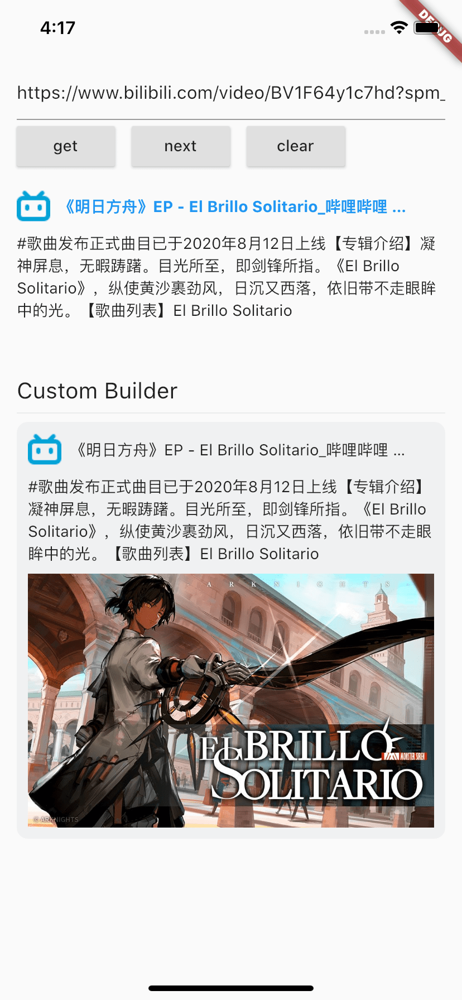
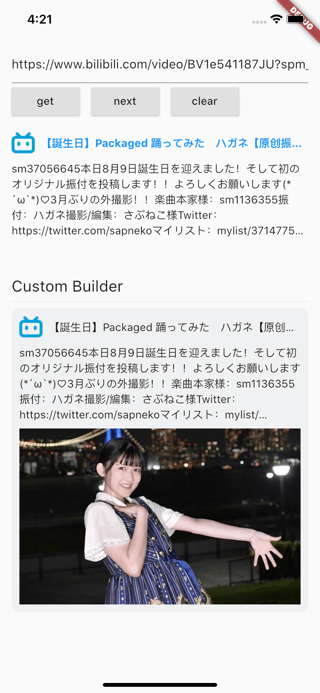

# flutter_link_preview

This is a URL preview plugin that previews the content of a URL

Language: [English](README.md) | [中文简体](README-ZH.md)


## Special feature

-   Use multi-processing to parse web pages, avoid blocking the main process
-   Support for content caching and expiration mechanisms to return results faster
-   Better fault tolerance, multiple ways to find icons, titles, descriptions, image
-   Better support gbk code, no messy code
-   Optimized for large files with better crawl performance
-   Support for second hop authentication with cookies
-   Support gif, video and other content capture
-   Supports custom builder

## Getting Started

```dart
FlutterLinkPreview(
    url: "https://github.com",
    titleStyle: TextStyle(
        color: Colors.blue,
        fontWeight: FontWeight.bold,
    ),
)
```

Result:



## Custom Rendering

```dart
Widget _buildCustomLinkPreview(BuildContext context) {
  return FlutterLinkPreview(
    key: ValueKey("${_controller.value.text}211"),
    url: _controller.value.text,
    builder: (info) {
      if (info == null) return const SizedBox();
      if (info is WebImageInfo) {
        return CachedNetworkImage(
          imageUrl: info.image,
          fit: BoxFit.contain,
        );
      }

      final WebInfo webInfo = info;
      if (!WebAnalyzer.isNotEmpty(webInfo.title)) return const SizedBox();
      return Container(
        decoration: BoxDecoration(
          borderRadius: BorderRadius.circular(10),
          color: const Color(0xFFF0F1F2),
        ),
        padding: const EdgeInsets.all(10),
        child: Column(
          crossAxisAlignment: CrossAxisAlignment.start,
          children: <Widget>[
            Row(
              children: <Widget>[
                CachedNetworkImage(
                  imageUrl: webInfo.icon ?? "",
                  imageBuilder: (context, imageProvider) {
                    return Image(
                      image: imageProvider,
                      fit: BoxFit.contain,
                      width: 30,
                      height: 30,
                      errorBuilder: (context, error, stackTrace) {
                        return const Icon(Icons.link);
                      },
                    );
                  },
                ),
                const SizedBox(width: 8),
                Expanded(
                  child: Text(
                    webInfo.title,
                    overflow: TextOverflow.ellipsis,
                  ),
                ),
              ],
            ),
            if (WebAnalyzer.isNotEmpty(webInfo.description)) ...[
              const SizedBox(height: 8),
              Text(
                webInfo.description,
                maxLines: 5,
                overflow: TextOverflow.ellipsis,
              ),
            ],
            if (WebAnalyzer.isNotEmpty(webInfo.image)) ...[
              const SizedBox(height: 8),
              CachedNetworkImage(
                imageUrl: webInfo.image,
                fit: BoxFit.contain,
              ),
            ]
          ],
        ),
      );
    },
  );
}
```



## Sample code

[Click here for a detailed example](example/lib/main.dart).
